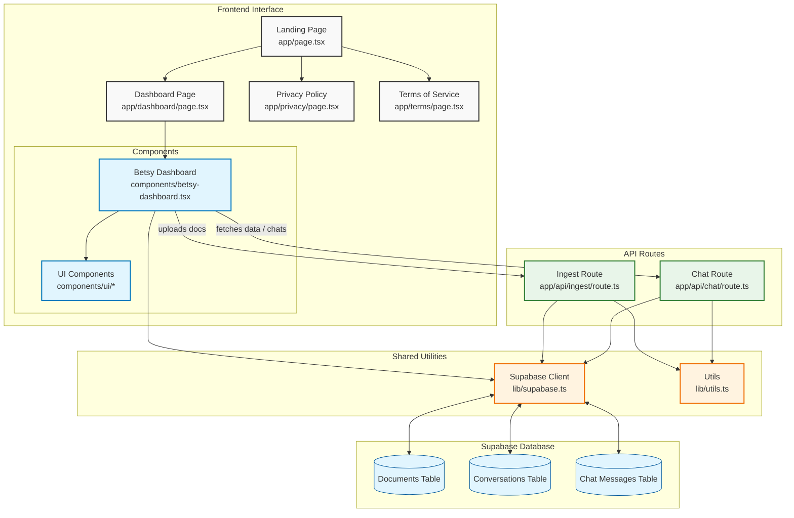

```mermaid
graph TD
    subgraph Frontend [Frontend Interface]
        Landing[Landing Page<br>app/page.tsx]
        DashboardPage[Dashboard Page<br>app/dashboard/page.tsx]
        Privacy[Privacy Policy<br>app/privacy/page.tsx]
        Terms[Terms of Service<br>app/terms/page.tsx]
        
        subgraph Components [Components]
            MainDB[Betsy Dashboard<br>components/betsy-dashboard.tsx]
            UI[UI Components<br>components/ui/*]
        end
    end

    subgraph Backend [API Routes]
        ChatAPI[Chat Route<br>app/api/chat/route.ts]
        IngestAPI[Ingest Route<br>app/api/ingest/route.ts]
    end

    subgraph Shared [Shared Utilities]
        SupabaseClient[Supabase Client<br>lib/supabase.ts]
        Utils[Utils<br>lib/utils.ts]
    end

    subgraph Database [Supabase Database]
        Documents[(Documents Table)]
        Conversations[(Conversations Table)]
        Messages[(Chat Messages Table)]
        
        style Documents fill:#e1f5fe,stroke:#01579b
        style Conversations fill:#e1f5fe,stroke:#01579b
        style Messages fill:#e1f5fe,stroke:#01579b
    end

    %% Relationships
    Landing --> DashboardPage
    Landing --> Privacy
    Landing --> Terms

    DashboardPage --> MainDB
    MainDB --> UI
    
    %% API Calls
    MainDB -- "fetches data / chats" --> ChatAPI
    MainDB -- "uploads docs" --> IngestAPI
    
    %% Utility Usage
    ChatAPI --> SupabaseClient
    IngestAPI --> SupabaseClient
    MainDB --> SupabaseClient
    
    ChatAPI --> Utils
    IngestAPI --> Utils
    
    %% Database Interaction
    SupabaseClient <--> Documents
    SupabaseClient <--> Conversations
    SupabaseClient <--> Messages
    
    %% Styling
    classDef page fill:#f9f9f9,stroke:#333,stroke-width:2px;
    classDef component fill:#e1f5fe,stroke:#0277bd,stroke-width:2px;
    classDef api fill:#e8f5e9,stroke:#2e7d32,stroke-width:2px;
    classDef lib fill:#fff3e0,stroke:#ef6c00,stroke-width:2px;
    
    class Landing,DashboardPage,Privacy,Terms page;
    class MainDB,UI component;
    class ChatAPI,IngestAPI api;
    class SupabaseClient,Utils lib;

```
